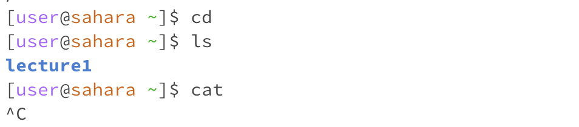

# Remote Access and FileSystem 
For each of the commands cd, ls, and cat, and using the workspace you created in this lab:
1. Share an example of using the command with no arguments.
2. Share an example of using the command with a path to a directory as an argument.
3. Share an example of using the command with a path to a file as an argument.

For each, include:

- A screenshot or Markdown code block showing the command and its output
- What the working directory was when the command was run
- A sentence or two explaining why you got that output (e.g. what was in the filesystem, what it meant to have no arguments).
- Indicate whether the output is an error or not, and if it’s an error, explain why it’s an error.

## 1. Share an example of using the command with no arguments. 

`cd: `
- what was the working directory when the command was run?
  \home
- how did you get the output?

- is the output an error? why or why not?

## 2. Share an example of using the command with a path to a directory as an argument 

## 3. Share an example of using the command with a path to a file as an argument.

