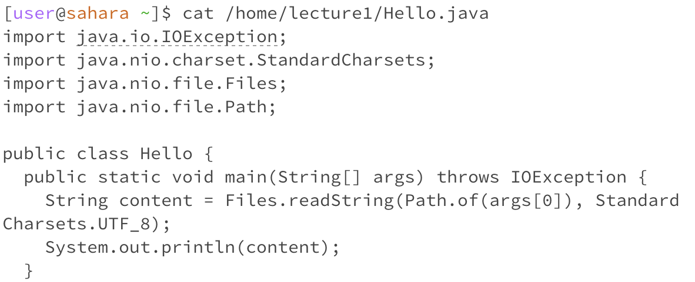

# Lab 1 - Remote Access and FileSystem 
For each of the commands `cd`, `ls`, and `cat`, and using the workspace you created in this lab:
1. Share an example of using the command with no arguments.
2. Share an example of using the command with a path to a directory as an argument.
3. Share an example of using the command with a path to a file as an argument.

For each, include:
- A screenshot or Markdown code block showing the command and its output
- What the working directory was when the command was run
- A sentence or two explaining why you got that output (e.g. what was in the filesystem, what it meant to have no arguments).
- Indicate whether the output is an error or not, and if it’s an error, explain why it’s an error.

## 1. Share an example of using the command with no arguments. 

*`cd` no argument:*

- **What was the working directory when the command was run?**
  `/home`
- **How did you get the output?**
      `cd` stands for change directory. Due to `cd` not having an argument, it would result in not having an output because there is no path to lead to another directory outside of `/home`.
- **Is the output an error? Why or why not?**
      The output is not an error. Due to `ls` not having an argument, it's the same as saying there's nothing to change. Therefore, there's no output error.

*`ls` no argument:*

- **What was the working directory when the command was run?**
      `/home`
- **How did you get the output?**
       `ls` is the library function in the terminal. By using `ls` at the `/home` directory, it shows what file and/or directory can be accessed directly from the working directory. In this case, the directory `lecture1` is the only one that can be directly accessed from `/home`.
- **Is the output an error? Why or why not?**
      The output is not an error. Due to `ls` not having an argument, it should only show that the `lecture1` directory can be accessed, unless otherwise noted in the argument. Only `lecture1` shows due to the fact that the directories in this lab are nested. Therefore, there's no output error.

*`cat` no argument:*

- **What was the working directory when the command was run?**
      `/home`
- **How did you get the output?**
       `cat` is the concatenate function in the terminal. It reads data from the file and gives its content as the output. It requires a path to output what is inside.
- **Is the output an error? Why or why not?**
      The output is not an error. Due to `cat` not having an argument, there is nothing to output and it shouldn't. The `^C` is an abort function to exit out of the `cat` function. If we didn't abort, the terminal would've been continuously running while outputting nothing. 
  

## 2. Share an example of using the command with a path to a directory as an argument 

*`cd` with directory path argument:*

- **What was the working directory when the command was run?**
  `/home/lecture1`
- **How did you get the output?**
      `cd` changed the directory from `/home` to `/home/lecture1` due to the  parameter path I've given to the function. 
- **Is the output an error? Why or why not?**
      The output is not an error. Although `ls` didn't technically output anything, if we take a look at the screenshot above, we can see that the terminal successfully changed working directories.

*`ls` with directory path argument:*

- **What was the working directory when the command was run?**
      `/home`
- **How did you get the output?**
       By using `ls` with the `/home/lecture1` directory argument, the output shows what directories and files can be accessed from the working directory. The `messages` directory is printed, highlighted, and bolded in blue, while the files are also outputted.
- **Is the output an error? Why or why not?**
      The output is not an error. `ls` did what the function was supposed to do with the given argument and the output reflected that. 

*`cat` with directory path argument:*

- **What was the working directory when the command was run?**
      `/home/lecture1`
- **How did you get the output?**
       `cat` read the data from the directory path and outputted the argument's content. 
- **Is the output an error? Why or why not?**
      The output is not an error. Though the argument isn't a file path, `cat` simply outputs and confirms that the directory is a directory.

## 3. Share an example of using the command with a path to a file as an argument.

*`cd` with file path argument:*

- **What was the working directory when the command was run?**
  `/home`
- **How did you get the output?**
      Due to the argument being a path file, `cd` outputted an error message since the argument is not a directory. 
- **Is the output an error? Why or why not?**
      The output is not an error. `cd` only takes directory path arguments, so it displays a necessary error message to the user about the wrong argument input. 

*`ls` with file path argument:*

- **What was the working directory when the command was run?**
      `/home`
- **How did you get the output?**
       By using `ls` with the `/home/lecture1/Hello.java` path argument, the output shows what directories and files can be accessed from the argument. In this case, there's no other directory or file that can be accessed from `/home/lecture1/Hello.java`. Therefore, the only accessible subject is its own file. 
- **Is the output an error? Why or why not?**
      The output is not an error. `ls` displayed the only possibilities to access other files, and in this example, it's the `Hello.java` file path. 

*`cat` with file path argument:*

- **What was the working directory when the command was run?**
      `/home`
- **How did you get the output?**
       `cat` read the data from the file path and outputted the file's content. 
- **Is the output an error? Why or why not?**
      The output is not an error. `cat` read `Hello.java` and displayed the contents within the file. Thus, it did what it was supposed to. 

