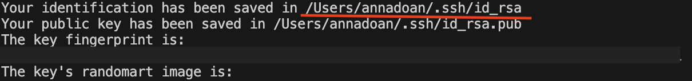
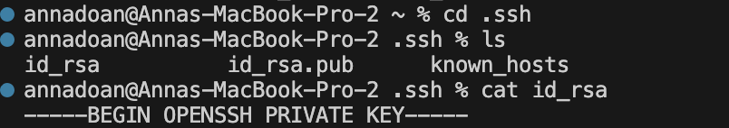
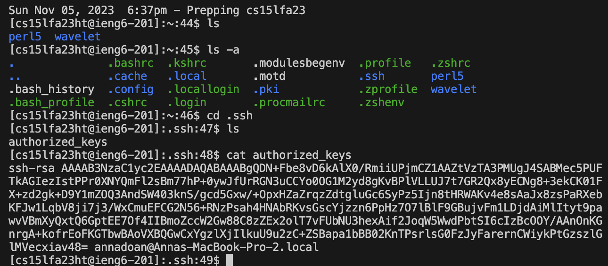

# Lab 2 - Servers and SSH Keys
**By Anna Doan**

## PART ONE
### My StringServer.java code:
~~~
import java.io.IOException;
import java.net.URI;

class Handler implements URLHandler {
    int num = 0;
    String str = "";

    public String handleRequest(URI url) {
        if (url.getPath().equals("/")) {
            return String.format("Welcome!", str);
        } else {
            if (url.getPath().contains("/add-message")) {
                String[] parameters = url.getQuery().split("=");
                if (parameters[0].equals("s")) {
                    num++;
                    str += num + ". "+ parameters[1] + "\n";
                    return str;
                }
            }
            return "404 Not Found!";
        }
    }
}

class StringServer {
    public static void main(String[] args) throws IOException {
        if(args.length == 0){
            System.out.println("Missing port number! Try any number between 1024 to 49151");
            return;
        }

        int port = Integer.parseInt(args[0]);

        Server.start(port, new Handler());
    }
}
~~~
**_Screenshot 1 of `/add-message` with 'CSE15L' input_**

**- Which methods in your code are called?**

The method called in my code would be `handleRequest`, since `/add-message?s=CSE15L` is a valid input for this method. 

  
**- What are the relevant arguments to those methods, and the values of any relevant fields of the class?**

The relevant arguments to the `handleRequest` method would be the `if (url.getPath().contains("/add-message"))` code block. It checks for the `/add-message?` path, otherwise it would return a `404 Not Found!` message. The values of the relevant fields would be `1. CSE15L\n` when it got passed into the `add-message` function. 

**- How do the values of any relevant fields of the class change from this specific request? If no values got changed, explain why.**

When the server started up, there were empty arguments in the methods. Since we fed the `"CSE15L"` query to the `/add-message` path, the values within the `str` and `num` variables in the `handleRequest` changed accordingly by running through the set parameters in the nested `if` and `if else` statements. The `num` value changed from 0 to 1. The `str` value changed from an empty string to the `"CSE15L"` input with the `num` value as a whole (with the `str += num +". " + parameters[1] + "\n"` line). 

**_Screenshot 2 of `/add-message` with "is fun!" input after Screenshot 1_**

**- Which methods in your code are called?**

In this case, the method called would be `handleRequest`. The new query, `"is%20fun!"` with the `/add-message` path, would run `handleRequest` again since it's a valid input to the `url.getPath().contains()` condition I set in the code. Note: The `%20` indicates a space in the input.

  
**- What are the relevant arguments to those methods, and the values of any relevant fields of the class?**

The relevant arguments to these methods would be in the `handleRequest` method with `/add-message?s=is%20fun!` as a valid input for the method. The `%20` indicates a space in the input. The `url.getPath().contains("/add-message")` line as it checks for the `\add-message` parameter. The values of the relevant fields are now `num` is 2, and `str` is now "2. is fun!" due to the `str += num +". " + parameters[1] + "\n"` line. 

**- How do the values of any relevant fields of the class change from this specific request? If no values got changed, explain why.**

Since this case is run after Screenshot 1, the `num` variable increments, and changes its value from 1 to 2. The `str` value would also change from the previous input to the new query while also incorporating the new `num` value, before outputting the combination as a string. This is due to the `str += num +". " + parameters[1] + "\n"` line in the `handleRequest` method. 

## PART TWO
**_Screenshot of the Path to the Private Key_**

The path to the private key is located in `/Users/annadoan/.ssh/id_rsa`.
_Note: I covered the fingerprint due to privacy reasons. The red underline is the path_

**_Screenshot of the Path to the Public Key_**

The path to the public key is located in `/Users/annadoan/.ssh/id_rsa.pub`.

**_Screenshot of the Terminal Interaction Logging into `ieng6`_**

## PART THREE
_Describe something you've learned from lab in week 2 or 3 that you didn't know before._

From week 3, I learned that scp is a command that allows the secure transferring of files and directories between a local host and a remote host, or between two remote hosts, without having to log into a remote system. I also learned that the mkdir is used to make a new directory. Another thing I found interesting is that you can access a manual of a command in the Visual Studio Code terminal with the `man <. . .>` function. 

