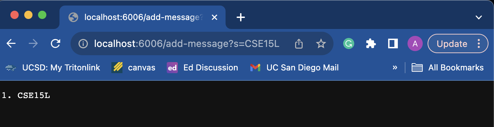

# Lab 2 - Servers and SSH Keys
**By Anna Doan**

## PART ONE
### My StringServer.java code:
~~~
import java.io.IOException;
import java.net.URI;

class Handler implements URLHandler {
    int num = 0;
    String str = "";

    public String handleRequest(URI url) {
        if (url.getPath().equals("/")) {
            return String.format("Welcome!", str);
        } else {
            if (url.getPath().contains("/add-message")) {
                String[] parameters = url.getQuery().split("=");
                if (parameters[0].equals("s")) {
                    num++;
                    str += num + ". "+ parameters[1] + "\n";
                    return str;
                }
            }
            return "404 Not Found!";
        }
    }
}

class StringServer {
    public static void main(String[] args) throws IOException {
        if(args.length == 0){
            System.out.println("Missing port number! Try any number between 1024 to 49151");
            return;
        }

        int port = Integer.parseInt(args[0]);

        Server.start(port, new Handler());
    }
}
~~~
**_Screenshot 1 of `/add-message`_**

**- Which methods in your code are called?**
  
**- What are the relevant arguments to those methods, and the values of any relevant fields of the class?**

**- How do the values of any relevant fields of the class change from this specific request? If no values got changed, explain why.**

**_Screenshot 2 of `/add-message`_**

**- Which methods in your code are called?**
  
**- What are the relevant arguments to those methods, and the values of any relevant fields of the class?**

**- How do the values of any relevant fields of the class change from this specific request? If no values got changed, explain why.**

## PART TWO
**_Screenshot of the Path to the Private Key_**

**_Screenshot of the Path to the Public Key_**

**_Screenshot of the Terminal Interaction Logging into `ieng6`_**

## PART THREE
_Describe something you've learned from lab in week 2 or 3 that you didn't know before_

