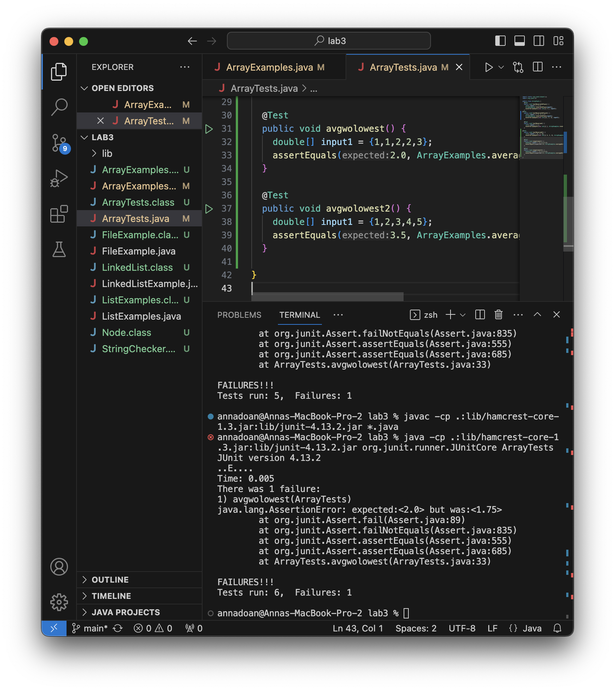
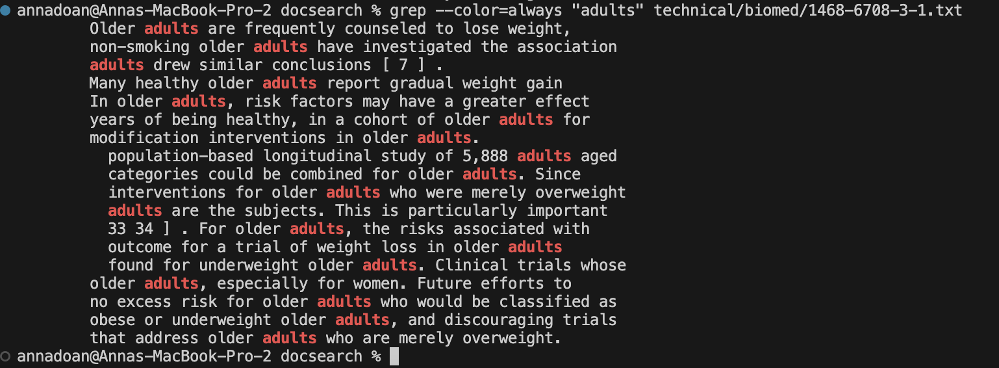

# Lab Report 3 -- Bugs and Commands
__By Anna Doan__
## PART ONE - BUGS
- A failure-inducing input for the buggy program, as a JUnit test and any associated code (write it as a code block in Markdown)
~~~
  @Test
  public void avgwolowest() {
    double[] input1 = {1,1,2,2,3};
    assertEquals(2.0, ArrayExamples.averageWithoutLowest(input1),0.01);
  }
~~~
- An input that doesn’t induce a failure, as a JUnit test and any associated code (write it as a code block in Markdown)
~~~
  @Test
  public void avgwolowest2() {
    double[] input1 = {1,2,3,4,5};
    assertEquals(3.5, ArrayExamples.averageWithoutLowest(input1),0.01);
  }
~~~
- The symptom, as the output of running the tests (provide it as a screenshot of running JUnit with at least the two inputs above)

- The bug, as the before-and-after code change required to fix it (as two code blocks in Markdown)

__Before the fix:__
~~~
  static double averageWithoutLowest(double[] arr) {
    if(arr.length < 2) { return 0.0; }
    double lowest = arr[0];
    for(double num: arr) {
      if(num < lowest) { lowest = num; }
    }
    double sum = 0;
    for(double num: arr) {
      if(num != lowest) { sum += num; }
    }
    return sum / (arr.length - 1);
  }
~~~

__After the fix:__
~~~
static double averageWithoutLowest(double[] arr) {
    if (arr.length <= 1) {
        return 0.0;
    }

    double lowest = arr[0];
    double sum = 0;
    int count = 0;

    for (double num : arr) {
        if (num < lowest) {
            lowest = num;
        }
    }

    boolean excludedOneLowest = false;
    for (double num : arr) {
        if (num == lowest && !excludedOneLowest) {
            excludedOneLowest = true;
        } else {
            sum += num;
            count++;
        }
    }

    if (count == 0) {
        return 0.0; // All elements in the array are the same (the lowest)
    }

    return sum / count;
  }

}
~~~
__Briefly describe why the fix addresses the issue:__

The fix addressed the issue that the code wouldn't take into account that there could be a possibility of having multiple lowest integers in an array, and will exclude them from the calculation. I modified the code to exclude only one occurrence of the lowest value instead of excluding all of the lowest values.

## PART TWO - RESEARCHING COMMANDS
I chose `grep`.
### Find four command-line options or alternate ways to use the `grep` command.
Give 2 examples of using it on files and directories from ./technical. Show each example as a code block that shows the command and its output, and write a sentence or two about what it’s doing and why it’s useful.

### 1. `-i` command-line option
[Link to -i ](https://www.freecodecamp.org/news/grep-command-in-linux-usage-options-and-syntax-examples/)

__Example of using `grep -i` on a file:__
~~~~
grep -i "emergency" technical/911report/chapter-9.txt
~~~~

Output:
~~~
Emergency response is a product of preparedness. On the morning of September 11,
                local public servants, especially the first responders: fire, police, emergency
                and exposed vulnerabilities in the World Trade Center's and the city's emergency
                to ensure safety, and elevators stopped. The public-address system and emergency
                Twin Towers. The 911 emergency call system was overwhelmed. The general evacuation
            To manage fire emergency preparedness and operations, the Port Authority created the
                with building occupants during an emergency.
                use the emergency intercom phone to obtain specific information on how to proceed.
                drill announcement advised participants that in the event of an actual emergency,
                provided at the time of an emergency. Civilians were not informed that rooftop
                Mayor's Office of Emergency Management (OEM).
                emergency, a leading role would be played by the Special Operations Division. This
                rescues, and the Emergency Service Unit (ESU), which carried out specialized rescue
                emergency call system. Its approximately 1,200 operators, radio dispatchers, and
                of emergency response. When a 911 call concerned a fire, it was transferred to FDNY
            Office of Emergency Management and Interagency Preparedness.
            In 1996, Mayor Rudolph Giuliani created the Mayor's Office of Emergency Management,
                Marco Crupi incident. After OEM's Emergency Operations Center was activated,
                response to the emergency," while the OEM was "designated the 'On Scene Interagency
                many civilians may have been unable to use the emergency intercom phones, as they
                emergency personnel to reach them. This advice was given to callers from the North
                to remain in place, it did not correspond to any prewritten emergency
            Emergency medical services (EMS) personnel were directed to one of four triage areas
            Around the city, the NYPD cleared major thoroughfares for emergency vehicles to
                of the North Tower-began to activate the Emergency Operations Center by calling such
                OEM. In addition, the Federal Emergency Management Agency (FEMA) was called and
            The emergency response effort escalated with the crash of United 175 into the South
                emergency personnel inside, as well a number of individuals-both first responders
                stairs and observed that the power was lost and emergency lights activated.
                largest loss of life of any emergency response agency in history. The PAPD suffered
                moved quickly north and established an emergency operations command post at the
            EMERGENCY RESPONSE ATTHE PENTAGON
            The emergency response at the Pentagon represented a mix of local, state, and federal
                management structure for emergency response, was in place in the National Capital
                terrorist attack affected the daily operations and emergency management requirements
            While no emergency response is flawless, the response to the 9/11 terrorist attack on
                relationships and trust established among emergency responders; second, the adoption
                State Police, the Virginia Department of Emergency Management, the FBI, FEMA, a
            Command was established at 9:41. At the same time, the Arlington County Emergency
                both sites will likely recur in any emergency of similar scale. The task looking
            Like the national defense effort described in chapter 1, the emergency response to
                911 operators and FDNY dispatch were not adequately integrated into the emergency
                disasters, it is important to integrate those taking 911 calls into the emergency
                would be "responsible for the management of the City's response to the emergency."
                by clearing emergency lanes to the WTC.
                emergency of this scale contributed to the early lack of units in the South Tower,
                not "responsible for the management of the City's response to the emergency," as the
            In May 2004, New York City adopted an emergency response plan that expressly
~~~

Using `grep -i`, we can command it to return lines containing the specified text pattern from the specified file, regardless of whether the pattern is in uppercase or lowercase. This is helpful for searching for specific keywords or text, and `grep -i` allows you to find all occurrences of those keywords, regardless of case sensitivity. 

__Example of using `grep -i` on a directory:__
~~~
grep -i "word" technical
~~~
Output:
~~~
grep: technical: Is a directory
~~~

`grep -i` doesn't work on directories since the `-i` command is designed to search for patterns within files. The output returns that the path is a directory.

### 2. `-n` command-line option:
[Link to -n](https://www.freecodecamp.org/news/grep-command-in-linux-usage-options-and-syntax-examples/)

__Example of using `grep -n` on a file:__
~~~
grep -n "We" technical/911report/preface.txt
~~~
Output:
~~~
5:            We present the narrative of this report and the recommendations that flow from it to
10:            We have come together with a unity of purpose because our nation demands it.
26:                our mandate. We have sought to be independent, impartial, thorough, and nonpartisan.
33:            We learned about an enemy who is sophisticated, patient, disciplined, and lethal. The
39:            We learned that the institutions charged with protecting our borders, civil aviation,
41:                adjust their policies, plans, and practices to deter or defeat it. We learned of
43:                between and within agencies. We learned of the pervasive problems of managing and
47:                We hope that the terrible losses chronicled in this report can create something
50:                meet the challenges now confronting us. We need to design a balanced strategy for
52:                the same time protecting our country against future attacks. We have been forced to
59:                Commissioners, whose dedication to this task has been profound. We have reasoned
61:                dialogue. We want to express our considerable respect for the intellect and judgment
63:            We want to thank the Commission staff. The dedicated professional staff, headed by
68:                have been superb. We thank the Congress and the President. Executive branch agencies
69:                have searched records and produced a multitude of documents for us. We thank
73:                assistance. We owe a huge debt to their investigative labors, painstaking attention
74:                to detail, and readiness to share what they have learned. We have built on the work
76:                fine work helped us get started. We thank the City of New York for assistance with
79:            We conclude this list of thanks by coming full circle: We thank the families of 9/11,
83:            We want to note what we have done, and not done. We have endeavored to provide the
87:                issues and organizations, we are conscious of our limits. We have not interviewed
89:                inevitably will come to light. We present this report as a foundation for a better
91:            We have listened to scores of overwhelming personal tragedies and astounding acts of
92:                heroism and bravery. We have examined the staggering impact of the events of 9/11 on
93:                the American people and their amazing resilience and courage as they fought back. We
95:                preparing to respond if it becomes necessary. We emerge from this investigation with
97:                for the American people. We recognize the formidable challenges that lie ahead.
98:            We also approach the task of recommendations with humility. We have made a limited
99:                number of them. We decided consciously to focus on recommendations we believe to be
100:                most important, whose implementation can make the greatest difference. We came into
103:                considered the views of others. We hope our report will encourage our fellow
~~~

`grep -n` returns the line and the line text that contains the specified text pattern. It's useful if we need to find a specific line to go back to and edit its contents. 

__Example of using `grep -n` on a directory:__
~~~
grep -n "We" technical/911report
~~~
Output: 
~~~
grep: technical/911report: Is a directory
~~~

`grep -n` doesn't work on a directory since it's intended for searching patterns within the content of files. The output returns that the path is a directory.

### 3. `--color` command-line option:
[Link to --color](https://linuxcommando.blogspot.com/2007/10/grep-with-color-output.html)

__Example of using `grep --color` on a file:__
~~~
grep --color=always "adults" technical/biomed/1468-6708-3-1.txt
~~~
Output:

`grep --color` returns lines that contain the specified text pattern but additionally, highlights the text pattern in red. This could be useful to help visualize where text patterns arise and give the coder a visual aid. 

__Example of using `grep --color` on a directory:__
~~~
grep --color=always "adults" technical/biomed
~~~
Output:
~~~
grep: technical/biomed: Is a directory
~~~

Unfortunately, `grep --color` does not work on directories since it looks for text patterns within a file. The output returns that the path is a directory.

### 4. `-R` command-line option:
[Link to -R](https://www.ibm.com/docs/sk/aix/7.1?topic=g-grep-command)

__Example of using `grep -R` on a file:__
~~~
grep -R "women" technical/biomed/1468-6708-3-1.txt
~~~
Output: 
~~~
technical/biomed/1468-6708-3-1.txt:          women. We calculated two sets of adjusted values, as
technical/biomed/1468-6708-3-1.txt:          (6.52 years for women or 6.06 for men). That is, a
technical/biomed/1468-6708-3-1.txt:        thirds of the men and a third of the women were former
technical/biomed/1468-6708-3-1.txt:        smokers. Black women had a higher mean BMI and higher
technical/biomed/1468-6708-3-1.txt:        10 pounds in the past year; white women were least
technical/biomed/1468-6708-3-1.txt:        to age 73. For example, black women averaged 6.3 YOL, but
technical/biomed/1468-6708-3-1.txt:        lost to death (7 minus YOL). White women had the most YHL
technical/biomed/1468-6708-3-1.txt:        and black men the fewest; black women had the most years of
technical/biomed/1468-6708-3-1.txt:        the most years to death (1.3 out of 7) while white women
technical/biomed/1468-6708-3-1.txt:        and 4). For example, YOL for women, adjusted for age, race,
technical/biomed/1468-6708-3-1.txt:        and smoking, averaged 6.0 years for women with a baseline
technical/biomed/1468-6708-3-1.txt:        BMI below 18.5, but averaged 6.6 years for women with a BMI
technical/biomed/1468-6708-3-1.txt:        YOL for women (the uppermost curve on Figure 1) averaged
technical/biomed/1468-6708-3-1.txt:        between BMI and YOL for BMI above 20. Underweight women
technical/biomed/1468-6708-3-1.txt:        averaged about .25 fewer YOL than other women (p < .05
technical/biomed/1468-6708-3-1.txt:        women and men. Women who were normal or overweight averaged
technical/biomed/1468-6708-3-1.txt:        about 4.9 YHL. The YHL for underweight or obese women was
technical/biomed/1468-6708-3-1.txt:        women than for men in the normal and overweight groups, but
technical/biomed/1468-6708-3-1.txt:        being compared. For example, underweight women averaged
technical/biomed/1468-6708-3-1.txt:        4.50 YHL compared to 4.92 for normal women, and the common
technical/biomed/1468-6708-3-1.txt:        treatment to help underweight women achieve normal weight
technical/biomed/1468-6708-3-1.txt:        about 93 women per treatment arm, if 7-year YHL were the
technical/biomed/1468-6708-3-1.txt:        sizes for women, and are significantly different from zero.
technical/biomed/1468-6708-3-1.txt:        for women showed a large and significant effect size. Thus,
technical/biomed/1468-6708-3-1.txt:        an intervention to improve the health of underweight women
technical/biomed/1468-6708-3-1.txt:        make obese women comparable to normal women could be
technical/biomed/1468-6708-3-1.txt:        overweight (for men or women) or obese (for men) affects
technical/biomed/1468-6708-3-1.txt:          older men and 30-35 for older women. In Figure 1, the
technical/biomed/1468-6708-3-1.txt:          older women could be efficient if YHL (but not YOL) was
technical/biomed/1468-6708-3-1.txt:          the outcome measure. That is, women who changed from
technical/biomed/1468-6708-3-1.txt:        older adults, especially for women. Future efforts to
~~~
The `grep -R` command displays all lines that contain the specified text pattern as well as the relative path of where to find the text patterns. 

__Example of using `grep -R` on a directory:__
~~~
grep -R "911" technical 
~~~
Output:
~~~
technical/government/About_LSC/commission_report.txt:S16911 (Oct. 17, 1986) (statement of Sen. Kennedy); March Comments
technical/government/About_LSC/State_Planning_Special_Report.txt:19881989199019911992199319941995199619971998199920002001
technical/government/Env_Prot_Agen/tech_adden.txt:children, 911
technical/government/Gen_Account_Office/Oct15-1999_gg00026t.txt:512-9110, and for information regarding GAO's work on GSA, please
technical/government/Gen_Account_Office/og96034.txt:Commission's Rules To Ensure Compatibility with Enhanced 911
technical/government/Gen_Account_Office/og96034.txt:Emergency Calling Systems (Wireless E911 Rules)
technical/government/Gen_Account_Office/og96034.txt:Rules To Ensure Compatibility with Enhanced 911 Emergency Calling
technical/government/Gen_Account_Office/og96034.txt:Systems (Wireless E911 Rules)" (FCC-96-264). We received the rule
technical/government/Gen_Account_Office/og96034.txt:requirements for basic wireless 911 services and establishes a
technical/government/Gen_Account_Office/og96034.txt:framework for improving wireless 911 services. The Commission
technical/government/Gen_Account_Office/og96034.txt:For basic wireless 911 services, the Order requires covered
technical/government/Gen_Account_Office/og96034.txt:carriers to transmit to public safety personnel all 911 calls
technical/government/Gen_Account_Office/og96034.txt:transmitting wireless 911 calls made by hearing-or speech-impaired
technical/government/Gen_Account_Office/og96034.txt:The Order also requires covered carriers to offer certain 911
technical/government/Gen_Account_Office/og96034.txt:cell site receiving a 911 call. Within the next 5 years, the Order
technical/government/Gen_Account_Office/og96034.txt:incorporated into enhanced 911 systems in the future.
technical/government/Gen_Account_Office/og96034.txt:OF THE COMMISSION'S RULES TO ENSURE COMPATIBILITY WITH ENHANCED 911
technical/government/Gen_Account_Office/og96034.txt:EMERGENCY CALLING SYSTEMS (WIRELESS E911 RULES) (FCC-96-264)
technical/government/Gen_Account_Office/og96034.txt:of 911 and enhanced 911 services through certain technologies.
technical/government/Gen_Account_Office/og96034.txt:Enhanced 911 Emergency Calling Systems, CC Docket No. 94102, 9 FCC
technical/government/Gen_Account_Office/og96034.txt:analysis describes how this Report and Order will make 911 and
technical/government/Gen_Account_Office/og96034.txt:enhanced 911 services for users of wireless telephones more widely
technical/government/Gen_Account_Office/og96034.txt:comments and reply comments regarding the wireless 911 issues. The
technical/government/Media/Law-school_grads.txt:Denver and $24,911 elsewhere in the state.
technical/government/Media/Marylands_Legal_Aid.txt:founded in 1911 and today recognized nationally for its leadership
technical/plos/pmed.0020034.txt:        for hay fever in 1911, the studies on hay fever prevalence by Ratner and Silverman in New
technical/biomed/gb-2003-4-4-r24.txt:        TNF locus (MIM *191160) has been
technical/biomed/gb-2003-4-5-r34.txt:          = 0.911 and 0.910 using average linkage or complete
technical/biomed/gb-2003-4-4-r26.txt:          AW589050-AW589115, AW735503-AW735730, AW782981-AW783662,
technical/biomed/gb-2001-2-8-research0030.txt:          aat sequences are AY039113,
technical/biomed/1471-2164-3-15.txt:          flanked by inverted repeats, specifically, Us (1911 bp,
technical/biomed/1471-2407-2-17.txt:          by end point cytopathogenic effect (CPE) assay on 911
technical/biomed/gb-2002-3-12-research0080.txt:          AF132565-AF132567, AF160911-AF160913,
technical/biomed/gb-2002-3-12-research0080.txt:          AY070911-AY070913, AY071674,
technical/biomed/1471-2199-3-12.txt:          on 911 cells [ 26 ] . Viral particles were determined by
technical/biomed/1471-2121-3-2.txt:        accession number Q09118) [ 2 ] was amplified by PCR using
technical/biomed/1471-2199-4-4.txt:          on 911 cells [ 19 ] . Viral particles were determined by
technical/biomed/rr196.txt:          numbers MA3-91 and MA3-911; Affinity BioReagents, Inc.,
technical/biomed/1471-2164-2-7.txt:          and AI591193) that were identical at the 
technical/biomed/1471-2156-4-9.txt:          other predicted F-box containing genes (CG4911, CG3428,
technical/911report/chapter-13.5.txt:                received by civilians in the towers based on (1) calls to NYPD 911 from or
technical/911report/chapter-13.5.txt:                September 11, 2001 (hereafter "Commission analysis of 911/PAPD calls"). Everyone
technical/911report/chapter-13.5.txt:                Commission analysis of 911/PAPD calls; Civilian interview 17 (May 11, 2004);
technical/911report/chapter-13.5.txt:                analysis of 911/PAPD calls; Port Authority transcripts of recorded Port Authority
technical/911report/chapter-13.5.txt:            32. Commission analysis of 911/PAPD calls.
technical/911report/chapter-13.5.txt:                2004); Civilian interview 14 (Apr. 7, 2004); Commission analysis of 911/PAPD calls.
technical/911report/chapter-13.5.txt:                7 (Mar. 22, 2004); Commission analysis of 911/PAPD calls. For some emergency
technical/911report/chapter-13.5.txt:            36. For callers being disconnected, see Commission analysis of 911/PAPD calls. For
technical/911report/chapter-13.5.txt:                and terminations, see Commission analysis of 911/PAPD calls.
technical/911report/chapter-13.5.txt:                callers, see Commission analysis of 911/PAPD calls. For standard operating
technical/911report/chapter-13.5.txt:                911/PAPD calls. For operators departing from protocol, see ibid.
technical/911report/chapter-13.5.txt:            40. Commission analysis of 911/PAPD calls; Port Authority transcripts of recorded
technical/911report/chapter-13.5.txt:            43. For smoke rising and its effect, see Commission analysis of 911/PAPD calls. For
technical/911report/chapter-13.5.txt:                911/PAPD calls; Port Authority transcripts of recorded Port Authority calls and
technical/911report/chapter-13.5.txt:            67. Commission analysis of 911/PAPD calls; NYPD recordings, City Wide 1, Special
technical/911report/chapter-13.5.txt:                interview 4 (Mar. 16, 2004); Commission analysis of 911/PAPD calls. For events in
technical/911report/chapter-13.5.txt:                (Mar. 16, 2004); Civilian interview 3 (May 4, 2004); Commission analysis of 911/PAPD
technical/911report/chapter-13.5.txt:            87. For conditions in the 90s and 100s, see Commission analysis of 911/PAPD calls.
technical/911report/chapter-13.5.txt:                floors, see Commission analysis of 911/PAPD calls.
technical/911report/chapter-13.5.txt:            88. For the callers, see Commission analysis of 911/PAPD calls. There are many
technical/911report/chapter-13.5.txt:                from floors higher up as well. It is not known, however, whether 911 callers had a
technical/911report/chapter-13.5.txt:            89. Commission analysis of 911/PAPD calls.
technical/911report/chapter-13.5.txt:                2004); Commission analysis of 911/PAPD calls.
technical/911report/chapter-13.5.txt:            91. Commission analysis of 911/PAPD calls.
technical/911report/chapter-13.5.txt:                Commission analysis of 911/PAPD calls.
technical/911report/chapter-13.5.txt:            96. Commission analysis of 911/PAPD calls. It is not clear whether callers from below
technical/911report/chapter-13.5.txt:                simply calling to seek advice. In any case, the 911 operators and FDNY dispatchers
technical/911report/chapter-13.5.txt:            150. For the 911 call, see Commission analysis of 911/PAPD calls. For the inaccurate
technical/911report/chapter-13.5.txt:            157. For information about 911 calls, see Commission analysis of 911/PAPD calls. For
technical/911report/chapter-13.5.txt:                www.whitehouse.gov/news/releases/2001/09/20010911-16.html).
technical/911report/chapter-9.txt:                Twin Towers. The 911 emergency call system was overwhelmed. The general evacuation
technical/911report/chapter-9.txt:                (which was not monitored by a dispatcher).17 The NYPD also supervised the city's 911
technical/911report/chapter-9.txt:                of emergency response. When a 911 call concerned a fire, it was transferred to FDNY
technical/911report/chapter-9.txt:                which had a center in each of the five boroughs. All 911 calls concerning fire
technical/911report/chapter-9.txt:            Civilians, Fire Safety Personnel, and 911 Calls
technical/911report/chapter-9.txt:            Within minutes, New York City's 911 system was flooded with eyewitness accounts of
technical/911report/chapter-9.txt:                had been advised to do in fire drills. Many called 911.
technical/911report/chapter-9.txt:            The 911 system was not equipped to handle the enormous volume of calls it received.
technical/911report/chapter-9.txt:                Some callers were unable to connect with 911 operators, receiving an "all circuits
technical/911report/chapter-9.txt:                emergencies to be transferred from 911 operators to FDNY dispatch operators in the
technical/911report/chapter-9.txt:            The 911 operators and FDNY dispatchers had no information about either the location
technical/911report/chapter-9.txt:            These critical decisions were not conveyed to 911 operators or to FDNY dispatchers.
technical/911report/chapter-9.txt:                as advised by 911 operators. Others simply continued to work or delayed to collect
technical/911report/chapter-9.txt:            The 911 operators and FDNY dispatchers were not advised that rooftop rescues were not
technical/911report/chapter-9.txt:            Civilians, Fire Safety Personnel, and 911 Calls
technical/911report/chapter-9.txt:                calling 911 for direction.
technical/911report/chapter-9.txt:            The 911 system remained plagued by the operators' lack of awareness of what was
technical/911report/chapter-9.txt:            In addition, the 911 system struggled with the volume of calls and rigid standard
technical/911report/chapter-9.txt:                impact zone and who stopped on the 31st floor in order to call 911, I told them when
technical/911report/chapter-9.txt:            Very few 911 calls were received from floors below the impact, but at least one
technical/911report/chapter-9.txt:                oxygen was running out. The last known 911 call from this location came at
technical/911report/chapter-9.txt:                repeated references in calls to 911 to having heard "announcements" to go down the
technical/911report/chapter-9.txt:            Those who called 911 from floors below the impact were generally advised to remain in
technical/911report/chapter-9.txt:                fire was above or below them, specifically asking if 911 operators had any
technical/911report/chapter-9.txt:                could only have come via 911. These workers were not trapped, yet unlike most
technical/911report/chapter-9.txt:                that 100 people were reported via 911 to be trapped on the 105th floor of the North
technical/911report/chapter-9.txt:            Interaction of 911 Calls and NYPD Operations.
technical/911report/chapter-9.txt:            At 9:37, a civilian on the 106th floor of the South Tower reported to a 911 operator
technical/911report/chapter-9.txt:                conveyed inaccurately by the 911 operator to an NYPD dispatcher. The dispatcher
technical/911report/chapter-9.txt:                further confused the substance of the 911 call by telling NYPD officers at the WTC
technical/911report/chapter-9.txt:                complex that "the 106th floor is crumbling" at 9:52, 15 minutes after the 911 call
technical/911report/chapter-9.txt:            The 911 calls placed from most locations in the North Tower grew increasingly
technical/911report/chapter-9.txt:                they will encounter during descent. Impact of 911 Calls on Evacuation. The NYPD's
technical/911report/chapter-9.txt:                911 operators and FDNY dispatch were not adequately integrated into the emergency
technical/911report/chapter-9.txt:                response. In several ways, the 911 system was not ready to cope with a major
technical/911report/chapter-9.txt:                911 operators and FDNY dispatchers, who for the next hour often continued to advise
technical/911report/chapter-9.txt:                impact zones. Nor were 911 operators or FDNY dispatchers advised that rooftop
technical/911report/chapter-9.txt:                upper floors of the South Tower who called 911 and were not told that their only
technical/911report/chapter-9.txt:                disasters, it is important to integrate those taking 911 calls into the emergency
technical/911report/chapter-9.txt:                receive and combine information from all first responders-including 911 operators.
~~~
`grep -R` searches through all the directories recursively that contain the specified text pattern. In our output, it displayed every instance of when `911` was used in all the directories and also returned the relative path correlating to the text. 
