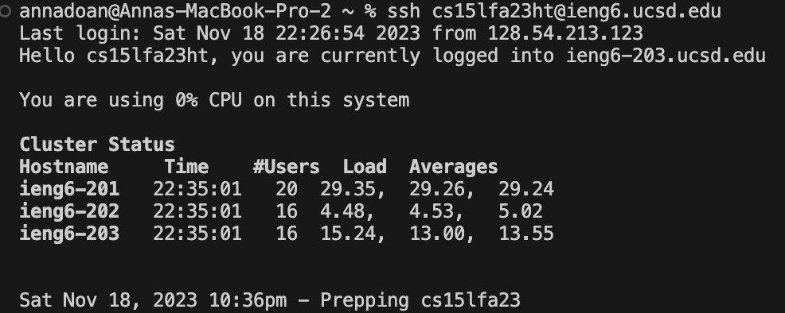
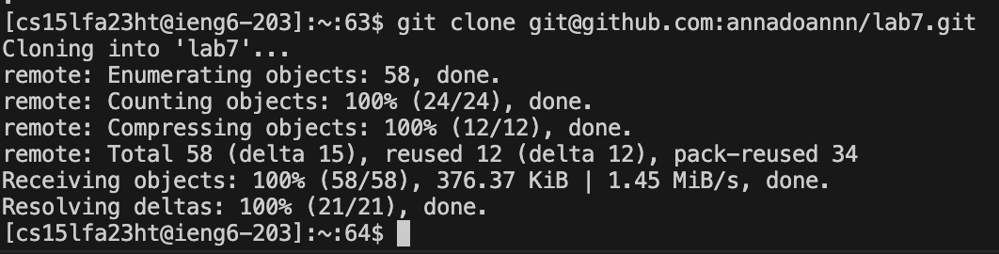
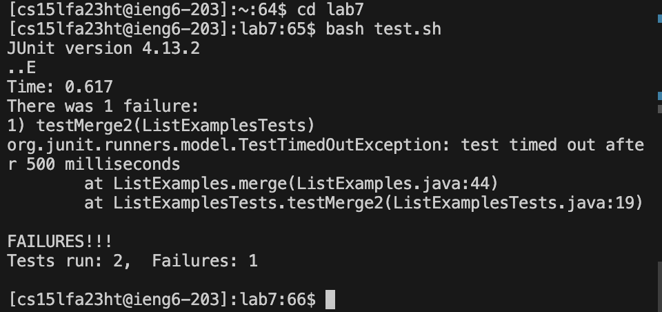
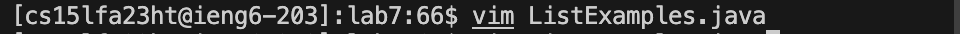
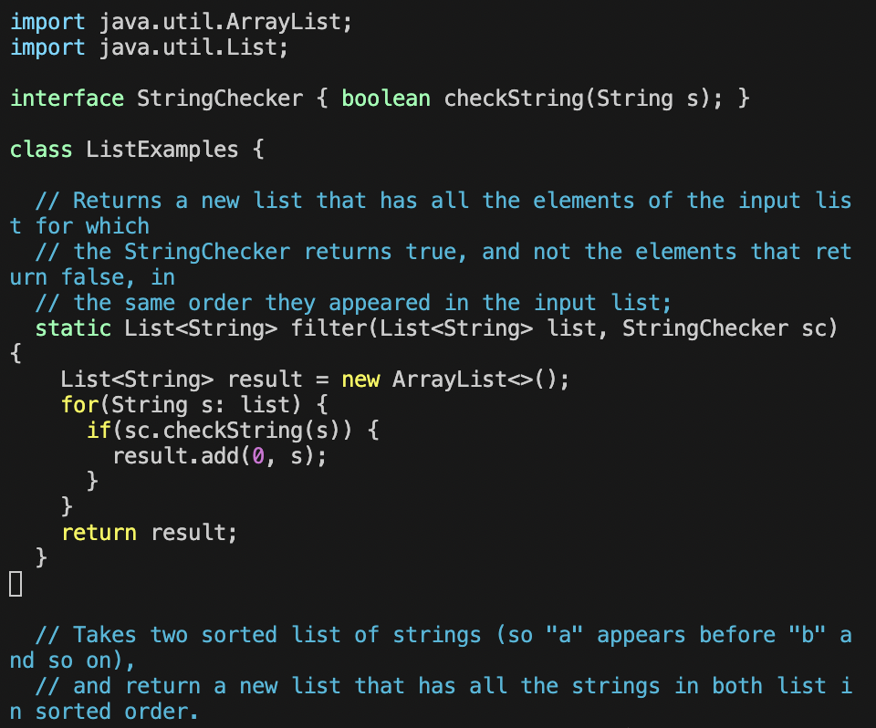
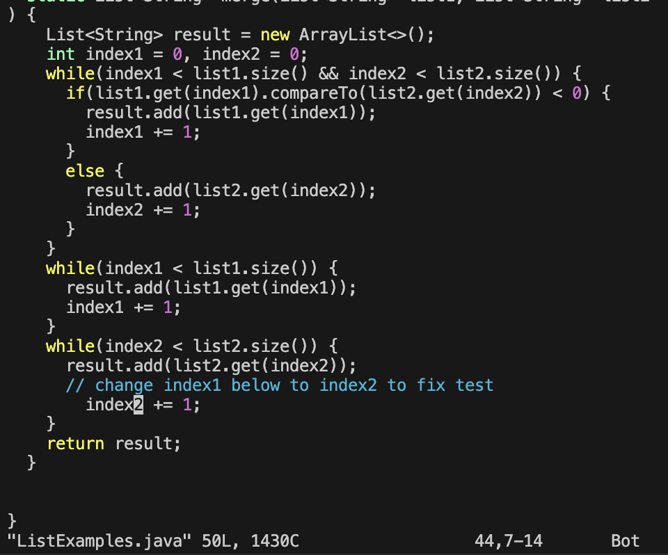
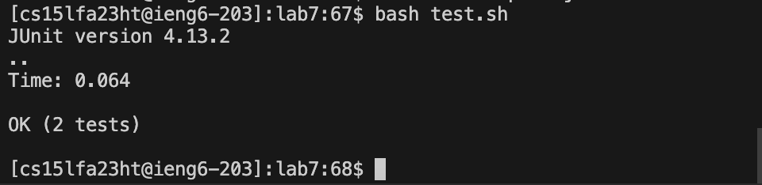
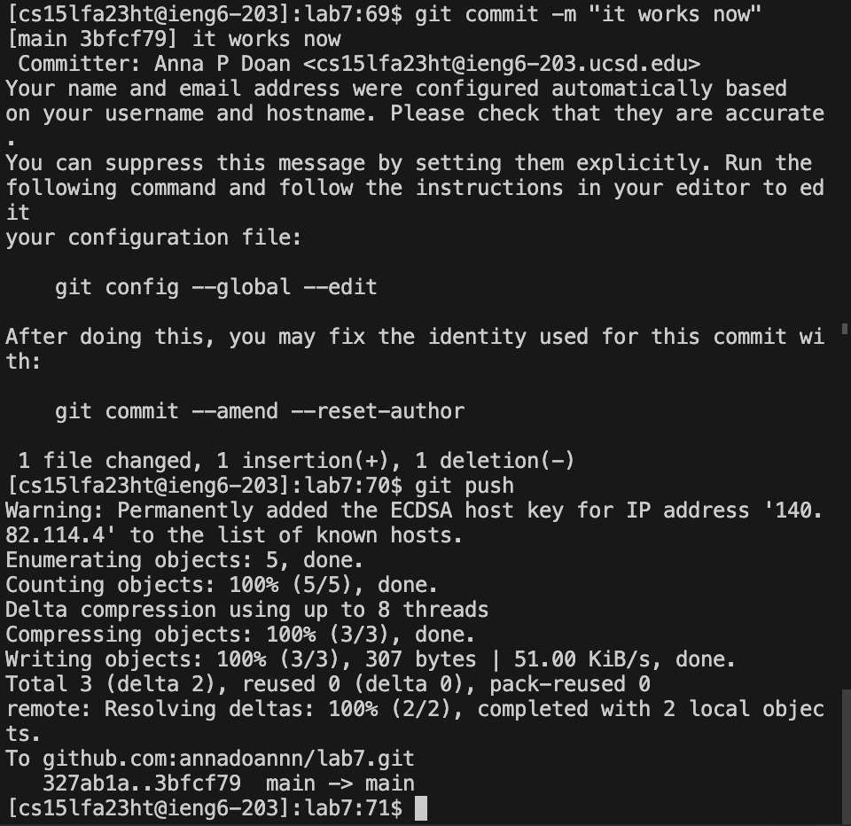

# Lab Report 4 -- Vim
__By Anna Doan__

We were instructed to do steps 4-9 from [week 7 lab](https://ucsd-cse15l-f23.github.io/week/week7/#week7-lab-report)

## Step 4 -- Log into ieng6
I typed `ssh cs15lfa23ht@ieng6.ucsd.edu`, then `<enter>` to execute.

## Step 5 -- Clone your fork of the repository from your Github account (using the SSH URL)
I typed `git clone git@github.com:annadoannn/lab7.git<enter>`.

## Step 6 -- Run the tests, demonstrating that they fail
I typed `cd lab7<enter>` then `bash test.sh<enter>`.

## Step 7 -- Edit the code file to fix the failing test
I typed `vim ListExamples.java<enter>`:

which led me to here:

Then, I typed `<shift+g>` and proceeded with `<up><up><up><up><up><up> <shift+e> <x><a> <left> <2> <esc>`

Then, I typed `<:wq> <enter>` to save and exit out of vim. 

## Step 8 -- Run the tests, demonstrating that they now succeed
I ran the test again by typing `bash test.sh`. 

It shows that the tests succeeded. 

## Step 9 -- Commit and push the resulting change to your Github account (you can pick any commit message!)
I typed `git add ListExamples.java`.

Then, I typed `git commit -m "it works now"` for a commit message, and proceeded to push the change into Github by typing `git push`.

