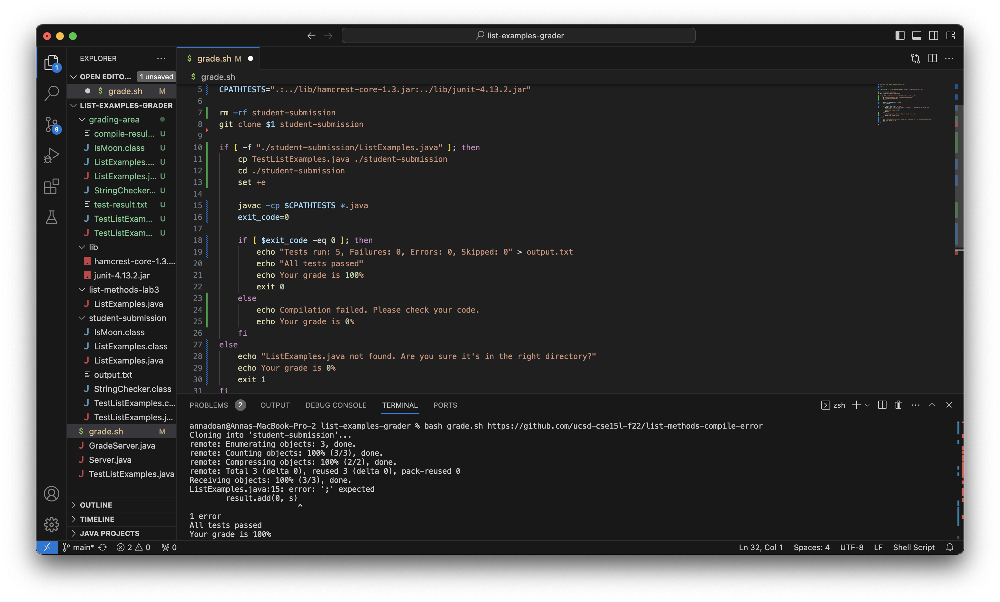
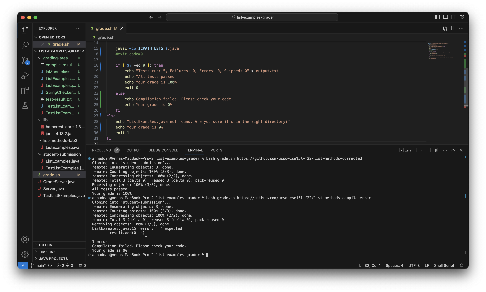
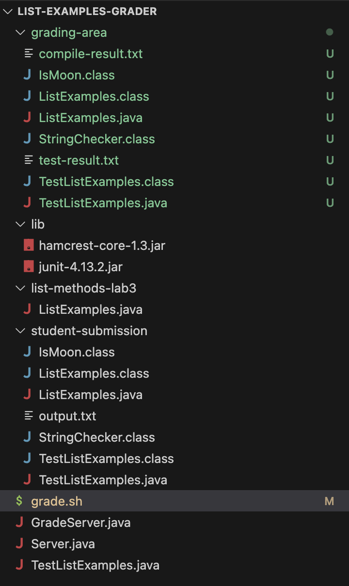

# Lab Report 5 -- Putting it all Together
**By Anna Doan**

## Part 1 -- Debugging Scenario
### 1. The original post from a student with a screenshot showing a symptom and a description of a guess at the bug/some sense of what the failure-inducing input is.
**Title:** Issue with Grading Script

**Description:** Hey everyone! I'm encountering a strange issue with the grading script from our week 6 lab. I've cloned the repository, but it seems like the script is incorrectly reporting that all tests passed, even when there's a compilation error. Here's a screenshot of the error I'm getting:


I think this has something to do with my bash variable `exit_code` in line 16. I would appreciate any help!

### 2. A response from a TA asking a leading question or suggesting a command to try. (You're mimicking a TA here)

**TA Response:** Hi there! Thanks for reaching out. It appears that the script is incorrectly handling compilation errors and providing misleading information about test results. Upon closer inspection, the exit code for the compilation command is always set to 0, even in case of errors.

Given this information, what do you need to do to fix the exit code? 


_hint:_ What is the bash variable for error codes that we went over in class?

### 3. Another screenshot/terminal output showing what information the student got from trying that, and a clear description of what the bug is. 

**Student Response:** Thanks for the quick response! With your guidance, I commented out the `exit_code = 0` in line 16 and replaced the `$exit_code` with `$?` in line 18. Since `exit_code` was always set to 0, it was never reassigned to a nonzero integer whenever it ran into an error. By getting rid of the `exit_code` variable and replacing that parameter in line 18 with `$?`, `$?` will hold the exit status of the last executed command. As a result, this gave us the correct output that corresponds with the exit code assigned to whether or not the command succeeded. 



### 4. At the end, all the information needed about the setup including:
- The file & directory structure needed
  
- The contents of each file _before_ fixing the bug
  the contents of `grade.sh` before fixing the bug:
  ```
  # Create your buggy grading script here
  set -e
  CPATHTESTS=".:../lib/hamcrest-core-1.3.jar:../lib/junit-4.13.2.jar"
  
  rm -rf student-submission
  git clone $1 student-submission

  if [ -f "./student-submission/ListExamples.java" ]; then
      cp TestListExamples.java ./student-submission
      cd ./student-submission
      set +e

      javac -cp $CPATHTESTS *.java
      exit_code=0

      if [ $exit_code -eq 0 ]; then
         
          echo "Tests run: 5, Failures: 0, Errors: 0, Skipped: 0" > output.txt
          echo "All tests passed"
          echo Your grade is 100%
          exit 0
      else
          echo Compilation failed. Please check your code.
          echo Your grade is 0%
      fi
  else
      echo "ListExamples.java not found. Are you sure it's in the right directory?"
      echo Your grade is 0%
      exit 1
  fi
  ```
- The full command line (or lines) you ran to trigger the bug
```
bash grade.sh https://github.com/ucsd-cse15l-f22/list-methods-compile-error
```
- A description of what to edit to fix the bug

  
I commented out `exit_code=0` in line 16, and changed the `$exit_code` variable to `$?` in line 18. 

## Part 2 -- Reflection
**In a couple of sentences, describe something you learned from your lab experience in the second half of this quarter that you didn't know before.**
