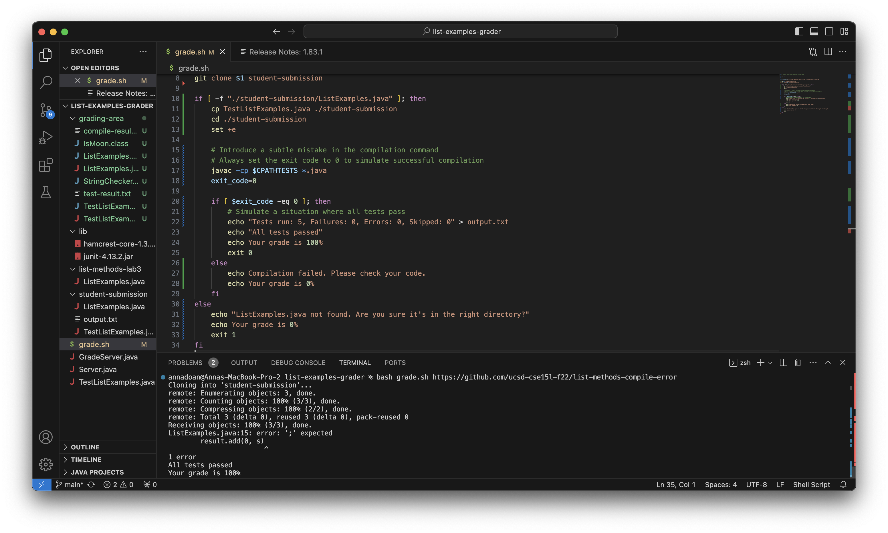

# Lab Report 5 -- Putting it all Together
**By Anna Doan**

## Part 1 -- Debugging Scenario
### 1. The original post from a student with a screenshot showing a symptom and a description of a guess at the bug/some sense of what the failure-inducing input is.
**Title:** Issue with Grading Script

**Description:** Hey everyone! I'm having trouble with the grading script from our week 6 lab. I cloned the repository, and my grade.sh script keeps telling me that the code works when there are errors. Here's a screenshot of the error I'm getting:


I think that this has something to do with my bash variable `exit_code`. Any help is appreciated!


### 2. A response from a TA asking a leading question or suggesting a command to try. (You're mimicking a TA here)
**TA Response:** Thanks for sharing the output! It appears that the grading script is not able to locate the Java files during the compilation step. In your script, the Java files are being copied to the `grading-area` directory, but the compilation command is looking for them in the current directory.

To fix this, update the compilation command in your script to include the correct path for the Java files. Modify the following line:

```
javac -cp $CPATHTESTS *.java
```

to:
```
javac -cp "$CPATHTESTS:grading-area" grading-area/*.java
```

### 3. Another screenshot/terminal output showing what information the student got from trying that, and a clear description of what the bug is. 
**Post:**


### 4. At the end, all the information needed about the setup including:
- The file & directory structure needed
- The contents of each file _before_ fixing the bug
- The full command line (or lines) you ran to trigger the bug
- A description of what to edit to fix the bug

## Part 2 -- Reflection
**In a couple of sentences, describe something you learned from your lab experience in the second half of this quarter that you didn't know before.**
